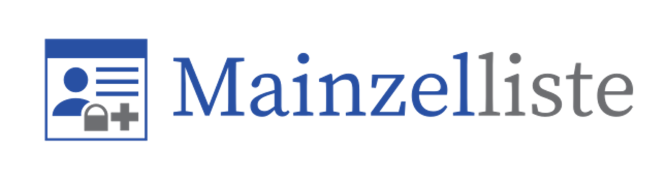
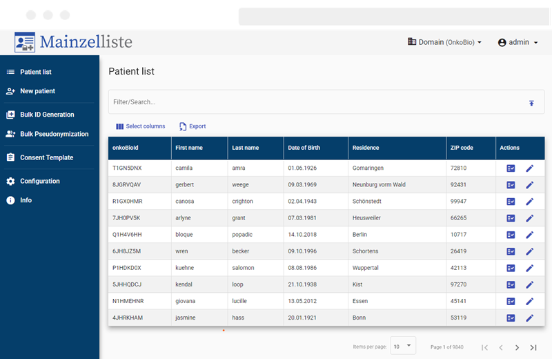

[](https://github.com/medicalinformatics/mainzelliste-gui/actions/workflows/ci.yml)
[](https://hub.docker.com/r/medicalinformatics/mainzelliste-gui/)

With the Mainzelliste UI your can easily manage your patient list, creating new ID, editing patient fields or deleting patient.   


## Installation Guidelines
### How to configure
Most of the configuration can be set using docker environment variables
#### Docker compose environment Variables
the docker image of the ui uses several environment variables :

| Environment Variable | Description                                                               | Required ? | Default Value                                                                                       |
|----------------------|---------------------------------------------------------------------------|------------|-----------------------------------------------------------------------------------------------------|
| MAINZELLISTE_URL     | the mainzelliste backend url                                              | Yes        | -                                                                                                   |
| ML_UI_MAIN_ID_TYPE   | default selected ID in create new patient page                            | no         | the backend default id type (is the first id type in the mainzelliste `idgenerators` configutation) |
| ML_UI_SHOW_ALL_IDS   | show all id in patient list view                                          | no         | false                                                                                               |
| ML_UI_DEBUG_MODE     | activate debug mode will initialize the patient list view with dummy data | no         | false                                                                                               |
| KEYCLOAK_URL         | Keycloak base url                                                         | Yes        | -                                                                                                   |
| KEYCLOAK_REALM       | Realm ID                                                                  | Yes        | -                                                                                                   |
| KEYCLOAK_CLIENT_ID   | Client ID                                                                 | Yes        | -                                                                                                   |

### Version Compatibility
Choosing the right version of the [Mainzelliste](http://mainzelliste.de) backend.

| Mainzelliste-UI      | Mainzelliste (backend) |
|----------------------|------------------------|
| 0.0.4  (Beta)        | 12.x                   |
| 0.0.5  (development) | 13.x (development)     |

### Running on Linux
1. copy the file `.env.default` to `.env` and set the environment variable `HOST` to the server name or ip address.
2. set your server name or ip address (`{HOST}`) in keyclok configuration
```bash
chmod u+x prepare-keycloak-import-file.sh
./prepare-keycloak-import-file.sh {HOST}
```
3. run ``docker-compose up -d``

#### Running in production mode behind a reverse proxy
Adjust your docker compose file, depending on the configuration of the reverse proxy:
  1. in `keycloak` service:
     1. change the `command` to `command: ["start"]`
     2. replace the environment variable `KC_HOSTNAME_URL` with :
```yml
      KC_PROXY: edge
      KC_HOSTNAME: ${HOST}
      KC_HTTP_RELATIVE_PATH: /keycloak
```
  2. in `mainzelliste` service:
     1. adjust both env. variables `ML_ALLOWED_ORIGINS` and `ML_OIDC_ISS`
  3. in `mainzelliste-gui` service:
     1. adjust both env. variables `KEYCLOAK_URL` and `MAINZELLISTE_URL`

#### Override the default configuration file
For more configuration your can override the [default configuration file](./src/assets/config/config.template.json) using the docker secret ``mainzelliste-gui.docker.conf``
```yaml
services: 
  mainzelliste-gui:
    secrets:
    - mainzelliste-gui.docker.conf
 
secrets:
  mainzelliste-gui.docker.conf:
    file: ./configs/mainzelliste-gui.docker.conf
```

## Developer Guide
### Running locally
1. Run `npm install -g @angular/cli` and `npm install` in the terminal in your project directory.
2. copy the file `.env.default` to `.env` and set the environment variable `HOST` to `localhost`.
3. **(optional)** populate the mainzelliste database with 100k patients `./init-demodata.sh`<br>
   *Note: `./rousource/demodata.sql` contains identifying demographic data set compiled from a lists of first and last names 
   provided by [Eli Finer in Gist](https://gist.github.com/elifiner/cc90fdd387449158829515782936a9a4)*, 
   randomly generated birthdate and german city and zip codes.
4. `docker-compose up mainzelliste mainzelliste-db keycloak keycloak-db -d`
5. create a configuration file `src/assets/config/config.json` and fill the content with the following code:
```json
{
  "patientLists": [
    {
      "url": "http://localhost:8080",
      "oAuthConfig": {
        "url": "http://localhost:8082",
        "realm": "mainzelliste",
        "clientId": "mainzelliste-ui"
      },
      "mainIdType": "pid",
      "showAllIds": false,
      "fields": [
        { "i18n": "first_name_text", "name": "Vorname", "mainzellisteField": "vorname"},
        { "i18n": "last_name_text", "name": "Nachname", "mainzellisteField": "nachname"},
        { "i18n": "birth_name_text", "name": "Geburtsname", "mainzellisteField": "geburtsname"},
        { "i18n": "birth_date_text", "name": "Geburtdatum", "mainzellisteFields": ["geburtstag", "geburtsmonat", "geburtsjahr"]},
        { "i18n": "residence_text", "name": "Wohnort", "mainzellisteField": "ort"},
        { "i18n": "zip_code_text", "name": "PLZ", "mainzellisteField": "plz"}
      ],
      "debug": false,
      "betaFeatures": {
        "consent": false,
        "copyConcatenatedId": false,
        "copyId": true,
        "configuration": true
      }
    }
  ]
}
```
6. Run `ng serve` for a dev server. Navigate to `http://localhost:4200`. The app will automatically reload if you change any of the source files.
7. You can now login with an admin user `username:admin and password:demo` or with other user e.g study nurse `username: study-nurse and password:demo` with restricted privileges

#### Setup keycloak configuration manually
1. Create new realm **mainzelliste**
   1. go to tab **General** and set **Html display name**: `<div class="kc-logo-text"><span></span></div>`
   2. go to tab **Themes** and choose login theme mainzelliste
2. Create new client **mainzelliste-ui**
   1. set **Root URL**, **Home URL** and **Web origins** to `http://localhost`
   2. set **valid redirect URI** and **valid post logout redirect URI** to `http://localhost/*`
   3. go to **Login Setting** and select mainzelliste as **Login theme**
3. Create two roles:
   1. go to **Clients** in the menu
   2. open `mainzelliste-ui` from the list
   3. go to tab **Roles** and create two roles `admin` and `study-nurse`
4. Create Role Mapper:
   1. go to **Client scopes** in the menu
   2. open **roles** from the list 
   3. got to tab **Mappers**
   4. Add new **Mapper "by configuration"** and choose **User Client Role** from the table
      1. set **Name** to e.g `User Client Role (Mainzelliste)`
      2. set **Token Claim Name** to `roles`
      3. Toggle the **Add to userinfo** switch to on
5. Create default new user for demo:
   1. go to **Users** in the menu
   2. add new user
   3. go to tab **Credentials** and add password
   4. go to tab **Role Mapping** and assign a Role:
      1. Filter the list by clients
      2. Select **admin** role and click assign

### Code scaffolding

Run `ng generate component component-name` to generate a new component. You can also use `ng generate directive|pipe|service|class|guard|interface|enum|module`.

### Build

#### Angular Project

Run `ng build` to build the project. The build artifacts will be stored in the `dist/` directory.

#### Docker Image

``docker build -t medicalinformatics/mainzelliste-gui:develop .``

### Running unit tests

Run `ng test` to execute the unit tests via [Karma](https://karma-runner.github.io).

### Running end-to-end tests

Run `ng e2e` to execute the end-to-end tests via a platform of your choice. To use this command, you need to first add a package that implements end-to-end testing capabilities.

### Export Keycloak Configuration
In order to export realm configuration including all users to one file, just run "bash" in keycloak container and execute the following command:
```bash
./opt/keycloak/bin/kc.sh export --file ~/mainzelliste-realm.json --users realm_file --realm mainzelliste
```
Now you can just copy the file to the resource order "resources/keycloak/import/" 
```bash
docker cp {keycloak-container-id}:/opt/keycloak/mainzelliste-realm.json ./resources/keycloak/import/
```

### Further help

To get more help on the Angular CLI use `ng help` or go check out the [Angular CLI Overview and Command Reference](https://angular.io/cli) page.

## License
Copyright 2021 - 2023 Federated Information Systems Team from DKFZ Heidelberg

Licensed under the Apache License, Version 2.0 (the "License"); you may not use this file except in compliance with the License. You may obtain a copy of the License at

http://www.apache.org/licenses/LICENSE-2.0

Unless required by applicable law or agreed to in writing, software distributed under the License is distributed on an "AS IS" BASIS, WITHOUT WARRANTIES OR CONDITIONS OF ANY KIND, either express or implied. See the License for the specific language governing permissions and limitations under the License.
